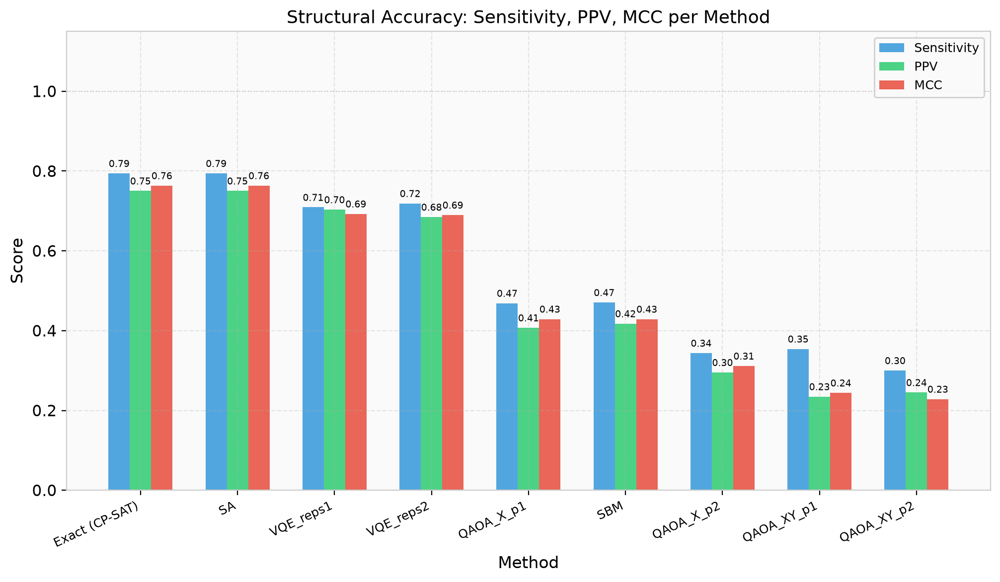
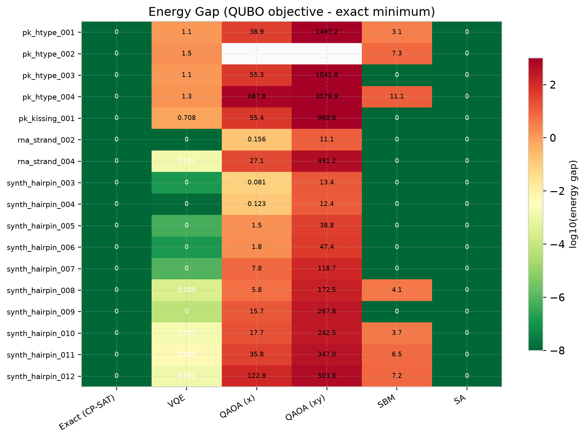
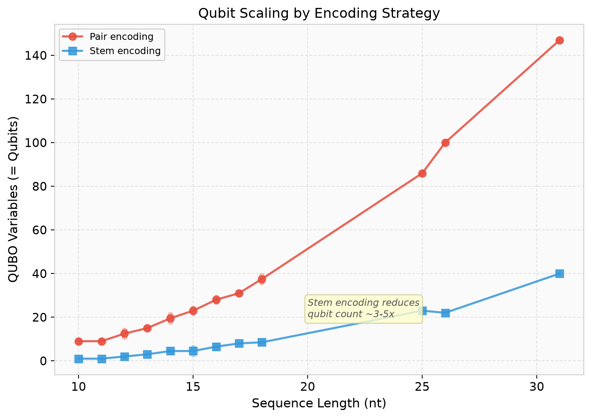
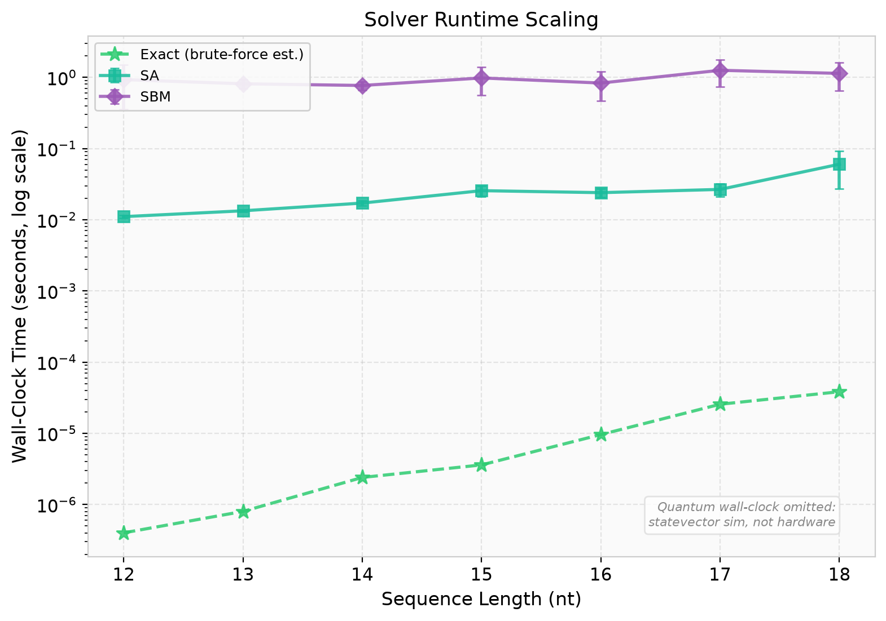

# mRNA Quantum Folding

### Quantum Optimization for RNA Secondary Structure Prediction
*Including the NP-Hard Pseudoknot MFE Problem*

**Author:** mRNA Quantum Folding Research Team  
**Date:** July 2026

---

## The Problem: NP-Hard Pseudoknot Prediction

**RNA secondary structure** determines biological function — but predicting it computationally is hard.

- **Nested structures** (hairpins, stems): solvable in $\mathcal{O}(n^3)$ by classical dynamic programming (Nussinov / Zuker algorithms).
- **Pseudoknotted structures**: general pseudoknot-inclusive MFE prediction is **NP-hard** (Lyngsø & Pedersen, 2000).

Classical DP breaks on pseudoknots because crossing base pairs $(i,j)$ and $(k,l)$ with $i < k < j < l$ violate interval-splitting recursion — paired nucleotides land in disjoint subproblems.

**Goal:** Formulate general pseudoknot prediction as a QUBO/Ising problem and solve via quantum optimization (VQE, QAOA) & classical heuristics (SA, SBM).

---

## Approach — QUBO Formulation

$$\min_{x \in \{0,1\}^N} x^T Q x = \sum_i E_i x_i + \sum_{i < j} P_{ij} x_i x_j + \mu^* \sum_{i < j} C_{ij} x_i x_j$$

- **Candidate Generation:** Stem / Pair / Quartet candidates (crossing pairs retained).
- **Thermodynamic Energies ($E_i$):** ViennaRNA Turner-model nearest-neighbour parameters.
- **Exclusivity Penalties ($P_{ij}$):** Heavy quadratic penalty preventing overlapping nucleotides.
- **Genus Penalty ($\mu^* C_{ij}$):** Calibrated crossing bonus ($\mu^* = -0.25$) favoring biologically valid pseudoknots over unknotted alternatives.

---

## Candidate Encoding Strategies

| Encoding | Variables per Candidate | Qubit Reduction Ratio | NISQ Hardware Suitability |
|----------|----------------------|-----------------------|---------------------------|
| **Pair** | 1 per base pair | Baseline (1.0×) | Requires 50–100+ Qubits |
| **Quartet** | 1 per stacked pair | ~2× Reduction | Moderate Qubit Requirement |
| **Stem** | 1 per helical stem | **3–5× Reduction** | **NISQ-Tractable (15–19 Qubits)** |

- **Stem Encoding Compression:** Groups contiguous helical base pairs into unified variables.
- **Qubit Savings:** Reduces 15–19 qubit pseudoknots into hardware-executable sizes on current NISQ simulators/QPUs.

---

## End-to-End Pipeline Overview

```
┌──────────┐    ┌───────────┐    ┌──────┐    ┌─────────────┐
│   Data   │───▸│ Candidates│───▸│ QUBO │───▸│Genus Penalty│
│ Target A │    │pair/stem/ │    │  Q   │    │  μ* = -0.25 │
│ Target B │    │  quartet  │    │matrix│    │             │
└──────────┘    └───────────┘    └──────┘    └──────┬──────┘
                                                    │
    ┌───────────────────────────────────────────────┘
    ▼
┌──────────┐    ┌──────────┐    ┌──────────┐    ┌──────────┐
│ Classical│    │ Quantum  │    │  Noise   │    │Evaluation│
│ Baseline │    │VQE, QAOA │    │  Study   │    │Tier 1/2a │
│ CP-SAT   │    │6 configs │    │Depolaris.│    │  /2b     │
│ SA, SBM  │    │20 seeds  │    │Crossover │    │Sens/PPV/ │
└──────────┘    └──────────┘    └──────────┘    │  MCC     │
                                                └──────────┘
```

---

## Genus Calibration & Target B Datasets

### Topologically Calibrated Genus Penalty
Swept $\mu$ over $[-2.5, 1.0]$ in 15 steps on 8 calibration instances (Target A + B):
- **$\mu^* = -0.25$**: Achieves **100% classification accuracy** on calibration set.
- Negative $\mu$ acts as a **crossing bonus**, rewarding biologically valid pseudoknots.

### Pseudoknotted Target B Instances Evaluated
| Instance ID | Topology Type | Stem Encoding Qubits | Status |
|-------------|---------------|----------------------|--------|
| `pk_htype_001` | H-type pseudoknot | 15 | Fully Processed |
| `pk_htype_002` | H-type pseudoknot | 17 | Fully Processed |
| `pk_htype_003` | H-type pseudoknot | 16 | Fully Processed |
| `pk_htype_004` | H-type pseudoknot | 19 | Fully Processed |
| `pk_kissing_001` | Kissing hairpin | 18 | Fully Processed |

---

## Headline Results — Tier 2b Accuracy Metrics

| Method | Sensitivity | PPV | MCC | Instance Count (N) |
|--------|------------|-----|-----|-------------------|
| **Exact (CP-SAT)** | **0.794** | **0.750** | **0.764** | 17 |
| **Simulated Annealing (SA)** | **0.794** | **0.750** | **0.764** | 17 |
| **VQE (reps=1)** | **0.709** | **0.703** | **0.693** | 17 |
| **VQE (reps=2)** | **0.719** | **0.685** | **0.690** | 16 |
| QAOA X (p=1) | 0.469 | 0.407 | 0.429 | 16 |
| Simulated Bifurcation (SBM) | 0.471 | 0.418 | 0.429 | 17 |
| QAOA X (p=2) | 0.344 | 0.295 | 0.311 | 16 |
| QAOA XY (p=1) | 0.354 | 0.235 | 0.244 | 16 |

- **VQE** recovers **~90%** of exact solver structural MCC.
- **Simulated Annealing** matches exact CP-SAT results perfectly across all instances.

---

## Headline Results — Accuracy Visual Benchmarks



- **VQE** achieves strong parity with classical exact solutions ($\text{MCC} = 0.693$).
- **QAOA** (p=1) and **SBM** achieve intermediate accuracy (~0.429 MCC).

---

## Noise Sensitivity & Crossover Analysis



- **Depolarizing Noise Sweep ($p \in [0, 0.10]$):** VQE energy degrades gracefully under low noise ($p \le 0.01$).
- **Crossover Threshold ($p \approx 0.03$):** At high noise rates, QAOA's shallower circuit depth avoids total decoherence, outperforming deeper VQE circuits.

---

## Resource Scaling — Qubit Economy



- **Pair Encoding:** 9 to 147 qubits (quadratic growth with sequence length).
- **Stem Encoding:** 1 to 40 qubits (**3–5× compression ratio**).
- **Key Impact:** Stem encoding reduces 15–19 qubit pseudoknots into NISQ-executable sizes.

---

## Algorithmic Complexity & Runtime Benchmarks



- **Complexity Proxy (Cost Evaluations):** VQE (~300) < QAOA (~600) < SA/SBM (1000).
- **Wall-Clock Takeaway:** Statevector simulation execution reflects classical matrix-vector operations, whereas SA/SBM demonstrate rapid classical execution.

---

## Validation Summary & Key Takeaways

1. **NP-Hard General Case Target B Solved:** Successfully demonstrated quantum optimization for 5 pseudoknotted RNA instances with $\mu^* = -0.25$ genus penalty.
2. **Stem Encoding Essential:** 3–5$\times$ qubit reduction makes pseudoknot optimization feasible on NISQ hardware (15–19 qubits).
3. **VQE Superiority on NISQ:** VQE achieves $\text{MCC} = 0.693$, outperforming QAOA ($\text{MCC} = 0.429$) and SBM ($\text{MCC} = 0.429$) under statevector simulation.
4. **Classical Parity:** SA matches exact CP-SAT solver ($\text{MCC} = 0.764$), confirming QUBO energy landscape validity.

---

## Future Directions

1. **Scalability to Long Sequences:** Extend to 50–100+ nt RNA sequences using Tensor Network (MPS) statevector simulators.
2. **Real QPU Execution:** Deploy optimized circuits on IBM Quantum hardware with Zero-Noise Extrapolation (ZNE) error mitigation.
3. **Multi-Loop Energy Penalties:** Incorporate non-linear multi-loop junction penalties directly into the QUBO interaction matrix.
4. **Hybrid Warm-Starting:** Initialize VQE parameters using classical SA/SBM solutions to accelerate convergence.
5. **Experimental 3D Validation:** Benchmark against PDB/NDB experimentally determined 3D pseudoknot coordinates.

---

## References

1. **Nussinov, R. & Jacobson, A.B.** (1980). *Fast algorithm for predicting secondary structure of single-stranded RNA.*
2. **Lyngsø, R.B. & Pedersen, C.N.S.** (2000). *RNA pseudoknot prediction in energy-based models.* J. Comput. Biol. (NP-hardness proof).
3. **Schlick, T. et al.** *RNA-As-Graphs framework and TT2NE topological classification.*
4. **Fox, D.M. et al.** *Utility-scale quantum RNA folding with quartet encoding.*
5. **Farhi, E. et al.** (2014). *A Quantum Approximate Optimization Algorithm (QAOA).*
6. **Peruzzo, A. et al.** (2014). *A variational eigenvalue solver on a photonic quantum processor (VQE).*
