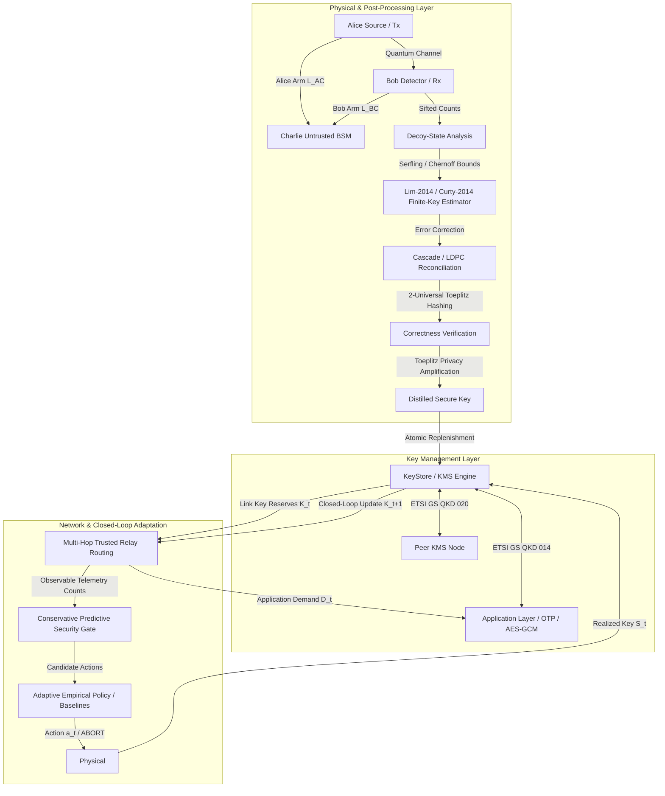

# End-to-End Quantum-Secure Network Testbed with Adaptive QKD, Finite-Key Security & Standards-Aligned Key Management

A research-oriented software testbed for decoy-state BB84, measurement-device-independent QKD (MDI-QKD), composable finite-key security analysis, classical post-processing, standards-aligned key management, multi-hop routing, and closed-loop adaptive protocol selection.

> [!NOTE]
> **Research & Emulation Scope**: This repository is a scientific simulation and emulation testbed. It implements exact finite-key theorems and network/KMS protocols over simulated quantum physical channels; it does not claim that raw physical laptop traffic is transmitted across a deployed optical quantum fiber.

---

## 1. System Architecture & Integrated Dataflow

The testbed connects physical quantum key generation, classical post-processing, key management systems (KMS), multi-node network routing, and machine-learning/heuristic adaptive controllers into an end-to-end closed loop:



---

## 2. Composable Security & Cryptographic Theorems

### Decoy-State BB84 (Theorem-Level Composable Security)
- **Primary Reference**: Lim, Curty, Walenta, Xu, Zbinden, *Phys. Rev. A* 89, 022307 (2014). [DOI: 10.1103/PhysRevA.89.022307](https://doi.org/10.1103/PhysRevA.89.022307).
- **Vacuum Event Lower Bound**: Implements published Eq. (2) using finite-statistical lower quantities:
  $$s_{X,0} \ge \tau_0 \frac{\mu_2 n^-_{X,\mu_3} - \mu_3 n^+_{X,\mu_2}}{\mu_2 - \mu_3}$$
  where $n^\pm$ are properly scaled by $e^\mu / p_\mu$, resolving scaling discrepancies between raw detection counts and finite fluctuations.
- **Composable Secrecy**: $\epsilon_{\rm sec}$-secrecy bounded via smooth min-entropy $H_{\min}^{\epsilon}(X|E)$ with Chernoff/Serfling finite-sampling bounds ($6\log_2(21/\epsilon_{\rm sec})$ penalty).
- **Information-Theoretic Correctness**: $\epsilon_{\rm cor}$-correctness via randomly seeded 2-universal Toeplitz hashing. The published verification tag length $t_{\rm ver} \ge \lceil -\log_2 \epsilon_{\rm cor} \rceil$ plus 1-bit verification announcement is deducted from secret key length to guarantee strict composable security.

### Measurement-Device-Independent QKD (Finite-Resource Engineering Model)
- **Primary References**: Lo, Curty, Qi, *Phys. Rev. Lett.* 108, 130503 (2012); Curty et al., *Nature Communications* 5, 3732 (2014).
- **Model Scope**: Implements finite-resource parameter estimation for asymmetric arm lengths ($L_{AC} \neq L_{BC}$) and asymmetric intensities to a central untrusted Bell-state measurement (BSM) station. Delineated from full theorem-level composable min-entropy proofs.

### Authenticated Encryption & OTP
- **Wegman-Carter Authentication**: Polynomial evaluation over Mersenne prime field $GF(2^{127}-1)$ with one-time pad masking. For 16-byte tags, information-theoretic forgery probability is bounded by $\lceil \text{len}(m)/16 \rceil / 2^{127}$.
- **One-Time Pad Invariant**: Key material is single-use only. Distinct keys are allocated from KMS for each encryption and authentication operation.

---

## 3. Standards Alignment (Research Scope)

This project provides standards-aligned research models rather than claiming complete production conformance:

| Standard | Role | Implementation Scope in Testbed |
|---|---|---|
| **ETSI GS QKD 014 V1.1.1** | Application Key Delivery | Implements `/status`, `/enc_keys`, `/dec_keys`. Atomic caller and initiator validation prevents mutation-before-authorization bugs. Key material in store copies is sanitized upon consumption. |
| **ETSI GS QKD 020 V1.1.1** | Interoperable KMS-to-KMS | Implements `/kmapi/versions` with capabilities array, transactional `/ext_keys` batch import, structured `/ack` handling, and scoped `/void`. |
| **ITU-T Y.3802 / Y.3803** | QKDN Architecture & KMS | Functional architecture separating quantum layer, key management layer, and application interface. |
| **ITU-T Y.3804** | Control & Management | Dynamic path rerouting and link outage recovery. |
| **ITU-T Y.3806 / Y.3823** | QoS Assurance & Allocation | Research QoS abstractions modeling hop counts, epsilon composition, and link reserve protection. |
| **ITU-T X.1711 (03/2026)** | Protocol Framework | Framework of quantum key distribution (QKD) protocols in QKD networks. |

---

## 4. Adaptive Runtime Evaluation & Baselines

### Independent Runtime Verification Architecture
To eliminate circular security claims, the adaptive runtime evaluation decouples the decision model from physical realization:
1. **Observable Telemetry**: Exact counts `(sent_pulses, detected_counts, observed_errors)` form Clopper-Pearson conservative confidence bounds.
2. **Predictive Security Gate**: Evaluates whether recommended candidate action $a_t$ is predicted to be secure and feasible. If not, safe `ABORT` is enforced.
3. **Independent Realized Simulation**: If executed, an independent physical realization with a distinct random seed and physical channel fluctuations generates counts and fresh finite-key estimation.
4. **Predictive Gate Miss vs. Security Violation Audit**: If an action passed the conservative gate but the independent realization failed (`abort=True` or $S_t \le 0$), a *predictive gate miss* is recorded. True *security violations* (releasing keys when an abort occurred) are strictly 0 by fundamental protocol construction.
5. **Closed-Loop State Evolution**: Key pool updates dynamically in bits:
   $$K_{t+1} = \min(K_{\max}, \max(0, K_t + S_t(a_t) - D_t))$$
6. **Time-Normalized Utility**: Evaluates service rate performance (bps), latency penalties, and control effort:
   $$U = \frac{\text{delivered}}{\Delta t} - 2.0 \frac{\text{deficit}}{\Delta t} - 0.05 \Delta t - \frac{C_{\rm switch}}{\Delta t}$$

### Six-Baseline Comparison
1. **Fixed BB84 Conservative**: Small block $N=10^{10}$, conservative intensities.
2. **Fixed BB84 Aggressive**: Large block $N=10^{11}$, higher intensity.
3. **Fixed MDI**: Fixed MDI action via central BSM relay.
4. **Training-Optimal Fixed**: Best single fixed action selected across the entire training set (evaluated across all scenarios with abort penalty).
5. **Heuristic Expert Policy**: Rule-based decision using QBER and distance thresholds.
6. **Always-Abort Baseline**: Safe zero-key abort.

### Statistical Validation
- Evaluated across 32 dynamic trajectories with balanced attack episodes and demand bursts across training and held-out test splits.
- **Trajectory Cluster Bootstrap**: Resamples whole trajectories with replacement ($N_{\rm boot} = 1000$) using Common Random Numbers (CRN) to properly account for temporal correlation, producing paired difference 95% confidence intervals and Cohen's $d$.

---

## 5. Reproducibility & Pipeline Execution

### Environment Setup
```powershell
# Create and activate virtual environment
python -m venv .venv
.venv\Scripts\Activate.ps1

# Install requirements and editable package
pip install -r requirements.txt
pip install -e .
```

### Running the Test Suite
```powershell
.venv\Scripts\pytest -v
```

### End-to-End Script Pipeline
Execute scripts sequentially to validate each layer:

```powershell
# 1. Theoretical Foundations & Mathematical Validation
python scripts\00_environment_check.py
python scripts\01_validate_math.py
python scripts\02_channel_sweep.py
python scripts\03_ideal_bb84.py
python scripts\04_decoy_asymptotic.py
python scripts\05_validate_decoy_lp.py
python scripts\06_finite_statistics.py
python scripts\07_finite_key_bb84.py

# 2. Classical Post-Processing & Reconciliation
python scripts\08_cascade_benchmark.py
python scripts\09_ldpc_benchmark.py
python scripts\10_privacy_amplification.py
python scripts\11_distill_decoy_bb84.py

# 3. Measurement-Device-Independent QKD
python scripts\12_mdi_physical.py
python scripts\13_mdi_decoy_estimation.py
python scripts\14_finite_key_mdi.py
python scripts\15_attack_sweep.py
python scripts\16_protocol_comparison.py

# 4. Key Management System & Applications
python scripts\17_kms_demo.py
python scripts\18_qkd014_conformance.py
python scripts\19_qkd020_interface_checks.py
python scripts\20_secure_application_demo.py

# 5. Network Simulation & Routing
python scripts\21_network_simulation.py

# 6. Adaptive Machine-Learning Controller & Evaluation
python scripts\22_build_policy_dataset.py
python scripts\23_fit_adaptive_policy.py
python scripts\24_evaluate_adaptive_policy.py

# 7. Unified End-to-End Closed-Loop Pipeline
python scripts\26_end_to_end_closed_loop.py

# 7. Interactive Dashboard
python scripts\25_run_dashboard.py
```

### Provenance Tracking
Every evaluation generates detailed provenance artifacts in `results/` logging:
- Exact Git commit SHA and working-tree cleanliness
- Dataset SHA-256 hashes
- Platform and Python runtime details
- Statistical bootstrap methodology and security audit outcomes