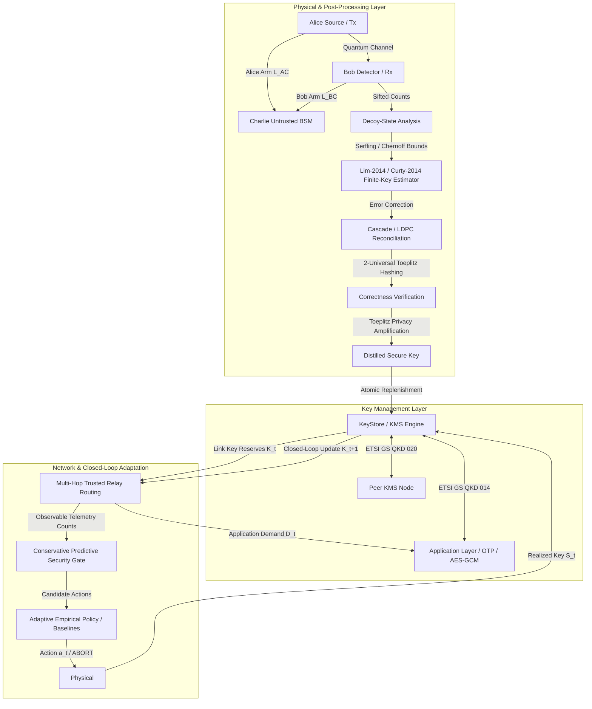

# End-to-End Quantum-Secure Network Testbed with Adaptive QKD, Finite-Key Security & Standards-Aligned Key Management

A research-oriented software testbed for decoy-state BB84, measurement-device-independent QKD (MDI-QKD), composable finite-key security analysis, classical post-processing, standards-aligned key management, multi-hop routing, and closed-loop adaptive protocol selection.

> [!NOTE]
> **Research & Emulation Scope**: This repository is a scientific simulation and emulation testbed. It implements exact finite-key theorems and network/KMS protocols over simulated quantum physical channels; it does not claim that raw physical laptop traffic is transmitted across a deployed optical quantum fiber.

---

## 1. System Architecture & Integrated Dataflow

The testbed connects physical quantum key generation, classical post-processing, key management systems (KMS), multi-node network routing, and machine-learning/heuristic adaptive controllers into an end-to-end closed loop:



---

## 2. Composable Security & Cryptographic Theorems

### Decoy-State BB84 (Theorem-Level Composable Security)
- **Primary Reference**: Lim, Curty, Walenta, Xu, Zbinden, *Phys. Rev. A* 89, 022307 (2014). [DOI: 10.1103/PhysRevA.89.022307](https://doi.org/10.1103/PhysRevA.89.022307).
- **Vacuum Event Lower Bound**: Implements published Eq. (2) using finite-statistical lower quantities:
  $$s_{X,0} \ge \tau_0 \frac{\mu_2 n^-_{X,\mu_3} - \mu_3 n^+_{X,\mu_2}}{\mu_2 - \mu_3}$$
  where $n^\pm$ are properly scaled by $e^\mu / p_\mu$, resolving scaling discrepancies between raw detection counts and finite fluctuations.
- **Composable Secrecy**: $\epsilon_{\rm sec}$-secrecy bounded via smooth min-entropy $H_{\min}^{\epsilon}(X|E)$ with Chernoff/Serfling finite-sampling bounds ($6\log_2(21/\epsilon_{\rm sec})$ penalty).
- **Information-Theoretic Correctness**: $\epsilon_{\rm cor}$-correctness via randomly seeded 2-universal Toeplitz hashing. The published verification tag length $t_{\rm ver} \ge \lceil -\log_2 \epsilon_{\rm cor} \rceil$ plus 1-bit verification announcement is deducted from secret key length to guarantee strict composable security.

### Measurement-Device-Independent QKD (Finite-Resource Engineering Model)
- **Primary References**: Lo, Curty, Qi, *Phys. Rev. Lett.* 108, 130503 (2012); Curty et al., *Nature Communications* 5, 3732 (2014).
- **Model Scope**: Implements finite-resource parameter estimation for asymmetric arm lengths ($L_{AC} \neq L_{BC}$) and asymmetric intensities to a central untrusted Bell-state measurement (BSM) station. Delineated from full theorem-level composable min-entropy proofs.

### Authenticated Encryption & OTP
- **Wegman-Carter Authentication**: Polynomial evaluation over Mersenne prime field $GF(2^{127}-1)$ with one-time pad masking. For 16-byte tags, information-theoretic forgery probability is bounded by $\lceil \text{len}(m)/16 \rceil / 2^{127}$.
- **One-Time Pad Invariant**: Key material is single-use only. Distinct keys are allocated from KMS for each encryption and authentication operation.

---

## 3. Key Management: Material Mode vs. Budget Mode

The KMS architecture incorporates an atomic `KeyReservoir` that supports dual operating modes:

### Material Mode (Cryptographic Distillation)
- **Operation**: Physical QKD distillation yields real privacy-amplified byte arrays deposited via `deposit_reservoir_key_material()`.
- **Slicing**: Continuous byte slices are extracted and encapsulated in `ManagedKey` objects tagged `source="material"`.
- **Use Case**: Exercised on physical links, local KMS stores, and end-to-end application payloads (One-Time Pad encryption and Wegman-Carter authentication).

### Budget Mode (High-Throughput Simulation)
- **Operation**: Tracks verified secure bit counts and synthesizes high-entropy CSPRNG keys tagged `source="budget_synthetic"`.
- **Use Case**: Used for high-throughput routing simulation, topology scaling studies, and extensive Monte Carlo trajectory sweeps without memory exhaustion.

### Composable Multi-Block Slicing & Exact Transactional Rollback
- **Composable Parameters**: Slicing across multiple reservoir blocks sums security error $\sum \epsilon_{\rm sec}$ and correctness error $\sum \epsilon_{\rm cor}$ under the union bound, recording composite protocol provenance.
- **Exact Material Rollback**: Reservations (`link.reserve_bits()`) slice exact byte segments from underlying blocks. If path reservation or destination KMS fails, `rollback()` restores the exact byte arrays into the blocks, avoiding numerical additions that would degrade material into synthetic budget.

---

## 4. Standards Alignment & Trusted Relay Semantics

This project provides standards-aligned research models rather than claiming complete production conformance:

| Standard | Role | Implementation Scope in Testbed |
|---|---|---|
| **ETSI GS QKD 014 V1.1.1** | Application Key Delivery | Implements `/status`, `/enc_keys`, `/dec_keys`. Atomic caller and initiator validation prevents mutation-before-authorization bugs. Key material in store copies is sanitized upon consumption. |
| **ETSI GS QKD 020 V1.1.1** | Interoperable KMS-to-KMS | Implements `/kmapi/versions` with capabilities array, transactional `/ext_keys` batch import, structured `/ack` handling, and scoped `/void`. Preserves key `source` provenance across imports. |
| **ITU-T Y.3802 / Y.3803** | QKDN Architecture & KMS | Functional architecture separating quantum layer, key management layer, and application interface. |
| **ITU-T Y.3804** | Control & Management | Dynamic path rerouting, link outage recovery, and atomic multi-hop reservation. |
| **ITU-T Y.3806 / Y.3823** | QoS Assurance & Allocation | Research QoS abstractions modeling hop counts, per-resource epsilon composition, and link reserve protection. |
| **ITU-T X.1711 (03/2026)** | Protocol Framework | Framework of quantum key distribution (QKD) protocols in QKD networks. |

### Fail-Closed Security Scope Hierarchy
The testbed enforces a strictly ordered, fail-closed security scope hierarchy:
$$\text{unverified} < \text{ideal\_simulation} < \text{engineering\_model} < \text{theorem\_composable}$$

- **Fail-Closed Defaults**: Links and reservoir blocks default to `unverified`.
- **Composite Monotonicity**: Any multi-block reservation or multi-hop path resolves to the minimum rank among its contributors.
- **Strict Composability Guard**: `is_composable=True` only if the resolved scope is `theorem_composable`. For all other scopes (`engineering_model`, `ideal_simulation`, `unverified`), `is_composable=False` and `eps_total=None` are reported to prevent treating heuristic parameters as mathematical composability bounds.

### Trusted Node Relay Semantics & Endpoint Confidentiality
- **Atomic Delivery**: Multi-hop end-to-end key requests (`request_end_to_end_key()`) execute as a single atomic transaction: hop reservations and source/target KMS insertions succeed completely or roll back entirely.
- **Resource Abstraction**: Hop key consumption models an ideal trusted relay. In this research model, key bits are consumed along each link of the path to model network-wide key depletion without simulating hop-by-hop ciphertext wrapping/unwrapping.
- **Confidentiality**: Routing metadata returned in `ServiceResult` excludes secret key bytes (`key_material` is never leaked outside KMS boundaries); applications retrieve keys strictly through authenticated local KMS interfaces (`consume_by_ids`).
- **Composable Security Gating**: End-to-end composable security $\epsilon_{\rm total} = \sum \epsilon_i$ is reported only when all traversed links are theorem-composable (e.g. BB84 Lim-2014). If an engineering model link (e.g. MDI Curty-2014) is traversed, `is_composable=False` and `eps_total=None` are reported to prevent mixing engineering models with theorem-level composable guarantees.

---

## 5. Adaptive Runtime Evaluation & Baselines

### Switching-Aware Empirical Contextual Policy
The adaptive controller is architected as a **switching-aware empirical contextual policy**:
- **Context Manifold**: Matches observable, non-anticipating telemetry features against calibrated scenario manifolds using scale-normalized Mahalanobis-like Euclidean distance.
- **Switching Penalty Awareness**: Directly penalizes setup delays and laser retuning overhead when transitioning between distinct active protocols ($C_{\rm switch} / \Delta t$).
- **Fail-Safe Gate**: Candidate decisions pass through an independent, conservative predictive security gate before physical realization.

### Independent Runtime Verification Architecture
To eliminate circular security claims, the adaptive runtime evaluation decouples the decision model from physical realization:
1. **Observable Telemetry**: Exact counts `(sent_pulses, detected_counts, observed_errors)` form Clopper-Pearson conservative confidence bounds.
2. **Predictive Security Gate**: Evaluates whether recommended candidate action $a_t$ is predicted to be secure and feasible. If not, safe `ABORT` is enforced.
3. **Independent Realized Simulation**: If executed, an independent physical realization with a distinct random seed and physical channel fluctuations generates counts and fresh finite-key estimation.
4. **Predictive Gate Miss vs. Security Violation Audit**: If an action passed the conservative gate but the independent realization failed (`abort=True` or $S_t \le 0$), a *predictive gate miss* is recorded. True *security violations* (`(released_key_bits > 0) and realized_abort`) are strictly 0 by fundamental protocol construction.
5. **Closed-Loop State Evolution**: Key pool updates dynamically in bits:
   $$K_{t+1} = \min(K_{\max}, \max(0, K_t + S_t(a_t) - D_t))$$
6. **Canonical Time-Normalized Utility**: Evaluates service rate performance (bps), latency penalties, and control effort:
   $$U = \frac{\text{delivered}}{\Delta t} - 2.0 \frac{\text{deficit}}{\Delta t} - 0.05 \Delta t - \frac{C_{\rm switch}}{\Delta t}$$

### Six-Baseline Comparison (Standardized 10.0s Decision Epoch)
1. **Fixed BB84 Conservative**: Block $N=10^{10}$ pulses ($\Delta t = 10.0$ s), conservative intensities ($\mu=0.40, \nu=0.05, p=0.80$).
2. **Fixed BB84 Aggressive**: Block $N=10^{10}$ pulses ($\Delta t = 10.0$ s), higher signal intensity ($\mu=0.55, \nu=0.10, p=0.90$).
3. **Fixed MDI**: Fixed MDI action via central BSM relay ($N=10^{10}$, $\Delta t = 10.0$ s).
4. **Training-Optimal Fixed**: Best single fixed action selected via full closed-loop trajectory simulation across all training trajectories with dynamic key-pool evolution. Designated as the primary comparator.
5. **Heuristic Expert Policy**: Rule-based decision using QBER and distance thresholds ($\Delta t = 10.0$ s).
6. **Always-Abort Baseline**: Safe zero-key abort ($\Delta t = 10.0$ s).

### Statistical Methodology & Multiple Testing Adjustment
- Evaluated across 96 dynamic trajectories (72 train, 24 held-out test) with balanced attack episodes and demand bursts across splits.
- **Paired Trajectory-Level Sign-Flip Randomization Test**: Exact exchangeable permutation test (10,000 permutations) on paired trajectory differences $D_i = U_{{\rm adaptive}, i} - U_{{\rm baseline}, i}$.
- **Bounded Numerical Resolution**: Exact permutation formula $(1 + \sum \mathbb{I}(|T_b| \ge |T_{\rm obs}|)) / (B + 1)$; reports bounded resolution $p < 0.0001$ rather than exact $0.0$.
- **Holm-Bonferroni Correction**: Step-down Family-Wise Error Rate (FWER) control across the 5 secondary baseline comparisons, keeping the primary hypothesis (`training_optimal_fixed`) unadjusted.
- **Whole-Trajectory Cluster Bootstrap**: 1,000 resamples of whole trajectories using Common Random Numbers (CRN) to construct 95% paired difference confidence intervals and Cohen's $d$.

---

## 6. Reproducibility & Pipeline Execution

### Environment Setup
```powershell
# Create and activate virtual environment
python -m venv .venv
.venv\Scripts\Activate.ps1

# Install requirements and editable package
pip install -r requirements.txt
pip install -e .
```

### Running the Test Suite
```powershell
.venv\Scripts\pytest -v
```

### End-to-End Script Pipeline
Execute scripts sequentially to validate each layer:

```powershell
# 1. Theoretical Foundations & Mathematical Validation
python scripts\00_environment_check.py
python scripts\01_validate_math.py
python scripts\02_channel_sweep.py
python scripts\03_ideal_bb84.py
python scripts\04_decoy_asymptotic.py
python scripts\05_validate_decoy_lp.py
python scripts\06_finite_statistics.py
python scripts\07_finite_key_bb84.py

# 2. Classical Post-Processing & Reconciliation
python scripts\08_cascade_benchmark.py
python scripts\09_ldpc_benchmark.py
python scripts\10_privacy_amplification.py
python scripts\11_distill_decoy_bb84.py

# 3. Measurement-Device-Independent QKD
python scripts\12_mdi_physical.py
python scripts\13_mdi_decoy_estimation.py
python scripts\14_finite_key_mdi.py
python scripts\15_attack_sweep.py
python scripts\16_protocol_comparison.py

# 4. Key Management System & Applications
python scripts\17_kms_demo.py
python scripts\18_qkd014_conformance.py
python scripts\19_qkd020_interface_checks.py
python scripts\20_secure_application_demo.py

# 5. Network Simulation & Routing
python scripts\21_network_simulation.py

# 6. Adaptive Contextual Controller & Evaluation
python scripts\22_build_policy_dataset.py
python scripts\23_fit_adaptive_policy.py
python scripts\24_evaluate_adaptive_policy.py

# 7. Unified End-to-End Closed-Loop Pipeline (Two-Track Decoupled Architecture)
python scripts\26_end_to_end_closed_loop.py

# 8. Interactive Dashboard
python scripts\25_run_dashboard.py
```

### Provenance Tracking
Every evaluation generates detailed provenance artifacts in `results/` logging:
- Exact Git commit SHA and working-tree cleanliness
- Dataset SHA-256 hashes
- Platform and Python runtime details
- Statistical bootstrap methodology and security audit outcomes