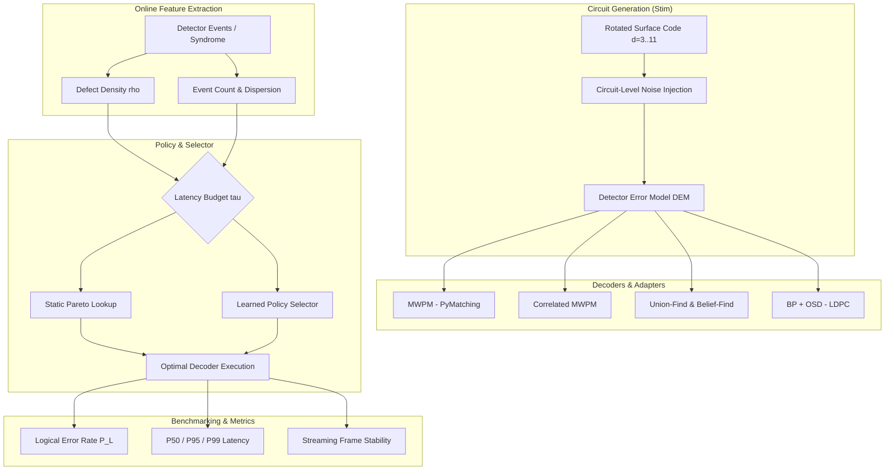
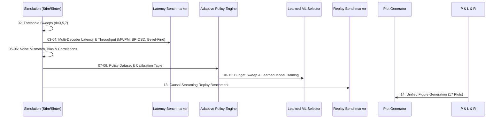
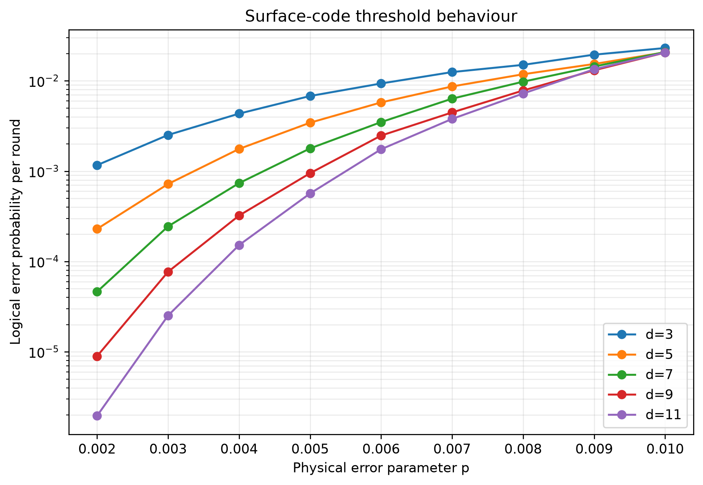
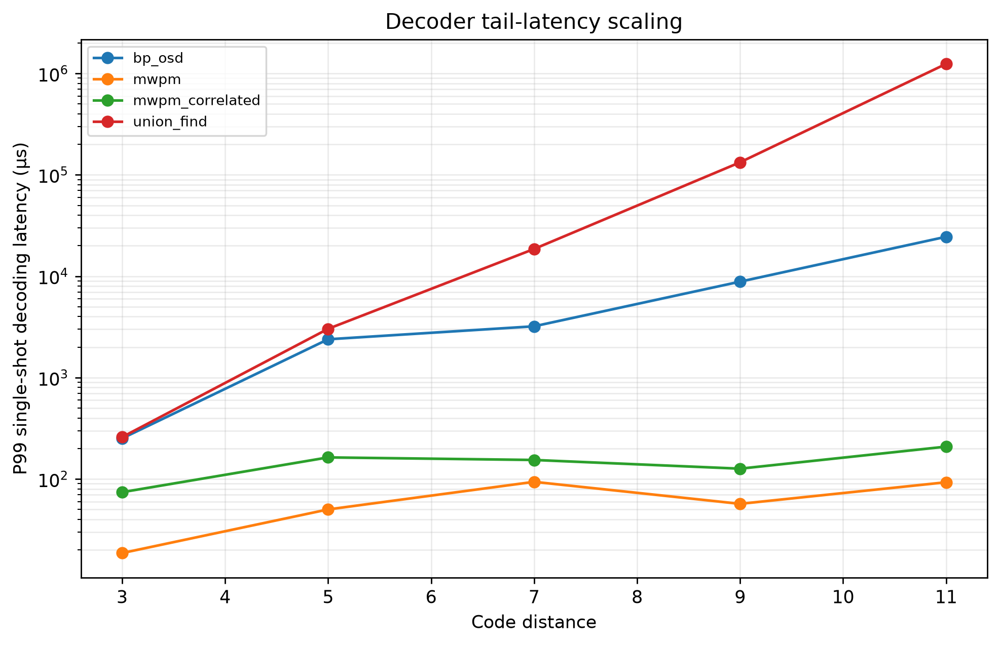
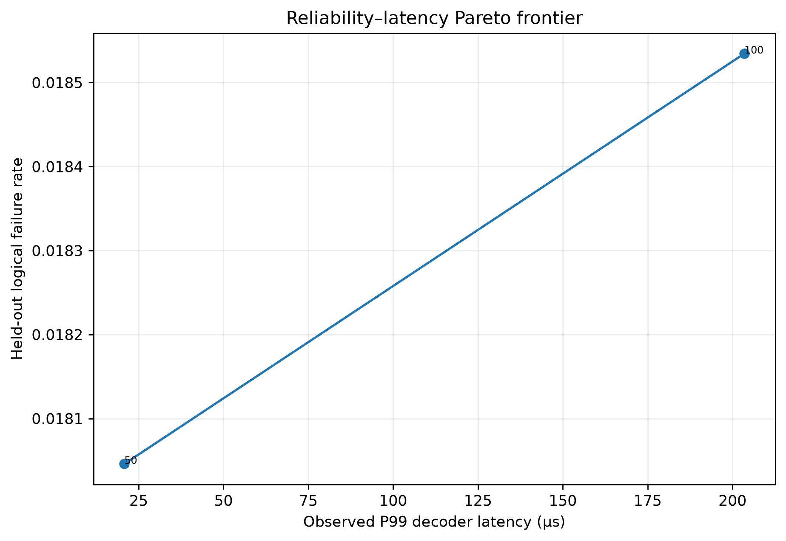
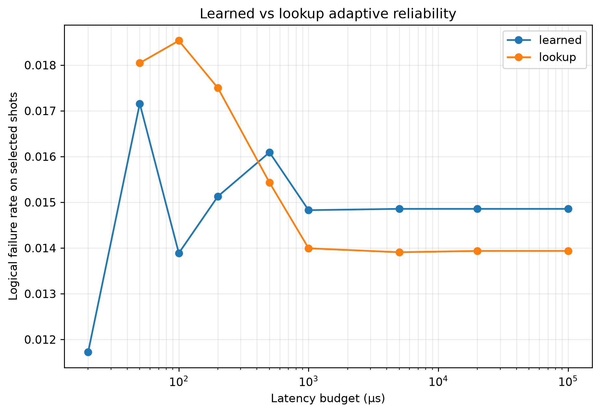
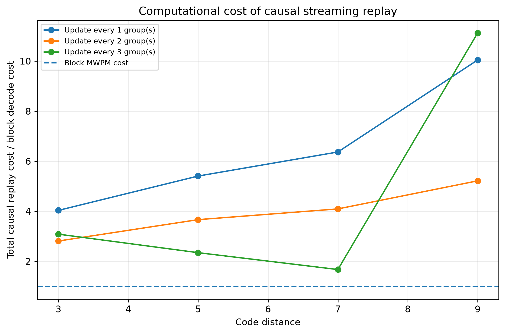
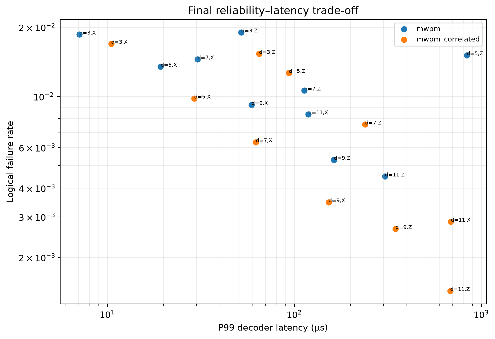

# Adaptive Surface-Code Decoding and Logical-Qubit Reliability Benchmarking under Circuit-Level Noise

[](#running-the-tests)
[](#installation)
[](LICENSE)
[](https://github.com/quantumlib/Stim)
[](https://github.com/oscarhiggott/PyMatching)

A comprehensive scientific framework for benchmarking quantum error correction (QEC) decoders, analyzing circuit-level noise dynamics in rotated planar surface codes, and evaluating online adaptive decoding policies under strict real-time latency budgets.

---

## Table of Contents
- [Overview](#overview)
- [Research Objective](#research-objective)
- [Framework Architecture](#framework-architecture)
- [Decoders](#decoders)
- [Noise Models](#noise-models)
- [Experimental Workflow](#experimental-workflow)
- [Adaptive Decoder Selection](#adaptive-decoder-selection)
- [Learned Decoder Selector](#learned-decoder-selector)
- [Causal Streaming-Replay Extension](#causal-streaming-replay-extension)
- [Key Results](#key-results)
- [Featured Figures](#featured-figures)
- [Installation](#installation)
- [Reproducing the Experiments](#reproducing-the-experiments)
- [Running the Tests](#running-the-tests)
- [Repository Structure](#repository-structure)
- [Limitations & Systems Caveats](#limitations--systems-caveats)
- [License](#license)

---

## Overview

Fault-tolerant quantum computing relies on quantum error correcting codes to protect fragile quantum information against physical decoherence and gate inaccuracies. The **surface code** is the leading candidate for near-term and large-scale fault tolerance due to its 2D nearest-neighbor lattice architecture and high fault-tolerance threshold ($\sim 0.7\% - 1.0\%$ under circuit-level depolarizing noise).

However, real-time quantum error correction imposes a severe **decoding backlog problem**: syndrome extraction cycles occur on microsecond timescales ($\sim 200\,\text{ns} - 1\,\mu\text{s}$ in superconducting qubits), while high-accuracy decoders (such as Belief Propagation with Ordered Statistics Decoding) often require millisecond timescales per syndrome on standard CPUs.

This repository provides an end-to-end experimental framework to investigate:
1. **Threshold & Sub-Threshold Scaling**: High-statistics Monte Carlo estimation of fault-tolerant thresholds and exponential logical suppression across code distances $d \in \{3, 5, 7, 9, 11\}$.
2. **Decoder Reliability vs. Latency Trade-offs**: Rigorous comparison of Minimum-Weight Perfect Matching (MWPM), Correlation-Aware MWPM, Union-Find (UF), BP+OSD, and Belief-Find / BP+Union-Find.
3. **Complex Noise Dynamics**: Biased Pauli dephasing ($p_Z \gg p_X, p_Y$), two-qubit gate error correlations, noise-model parameter mismatch, and leakage/erasure proxies.
4. **Adaptive & Learned Decoding**: Online syndrome feature extraction and policy-driven decoder dispatching that dynamically balances logical failure rates against real-time latency budgets ($\tau_{\text{budget}} \in [20\,\mu\text{s}, 100\,\text{ms}]$).
5. **Causal Streaming Replay**: Round-by-round prefix decoding simulating temporal syndrome streaming and evaluating frame update latency and correction stability.

---

## Research Objective

The primary scientific questions addressed by this framework are:
- **How do distinct decoding paradigms scale in reliability and tail latency (P50, P95, P99) under realistic circuit-level noise?**
- **How resilient are graph-based matching decoders to hyperedge correlations and prior probability mismatch?**
- **Can online syndrome features (such as defect density $\rho$, event count, and spatial dispersion) predict decoding difficulty fast enough to dynamically route syndromes to optimal decoders?**
- **Under what latency budgets does machine-learning-guided adaptive selection outperform static decoder assignment?**
- **How does round-by-round causal syndrome availability affect intermediate logical frame predictions during multi-round QEC?**

---

## Framework Architecture

The framework is structured as a modular Python package (`qec_lab`) supported by standalone execution scripts (`scripts/`) and automated test suites (`tests/`).



---

## Decoders

The framework provides unified interfaces across core decoding algorithms:

| Decoder | Engine / Backend | Theoretical Complexity | Strengths | Trade-offs |
|---|---|---|---|---|
| **MWPM** | [PyMatching](https://github.com/oscarhiggott/PyMatching) (C++ blossom) | $O(N \log N)$ average | Fast, robust, industry standard | Ignores hyperedge error correlations |
| **Correlated MWPM** | PyMatching (correlated weights) | $O(N \log N)$ average | Handles two-qubit correlated errors | Slight runtime overhead |
| **Union-Find (UF)** | `ldpc.UnionFindDecoder` (Python) | $O(N \alpha(N))$ theoretical | Near-linear algorithmic scaling | Sub-optimal threshold compared to MWPM |
| **Belief-Find** | `SinterBeliefFindDecoder` | $O(I_{\text{max}} \cdot N + N \alpha(N))$ | BP soft-decision synergy with UF peeling | Implementation dependent runtime |
| **BP+OSD** | `ldpc.BpOsdDecoder` + `beliefmatching` | $O(I_{\text{max}} \cdot N^2 + N^3)$ | High accuracy on correlated/LDPC codes | Higher latency; non-deterministic iterations |

---

## Noise Models

Experiments are conducted under realistic fault-tolerant noise environments generated via `stim`:

1. **Standard Circuit-Level Depolarizing Noise**:
   - Single-qubit gate depolarization: $p$
   - Two-qubit gate depolarization (e.g. `CX`, `CZ`): $p$
   - State preparation and measurement (SPAM) flip errors: $p$
   - Idle qubit depolarization during gate cycles: $p$
2. **Biased Noise Channels**:
   - Asymmetric Pauli channel with variable bias ratio $\eta = p_Z / (p_X + p_Y) \in [1, 100]$.
   - Independent tracking of logical $X$ and logical $Z$ failure rates.
3. **Correlated / Crosstalk Noise**:
   - Correlated two-qubit error mechanisms creating hyperedge detector graphs.
4. **Noise-Model Parameter Mismatch**:
   - Injected true error rate $p_{\text{true}}$ evaluated against mismatched decoder calibration priors $p_{\text{prior}} \in [0.1 \times p_{\text{true}}, 10 \times p_{\text{true}}]$.
5. **Erasure & Leakage Proxies**:
   - Modeling heralded erasures and state leakage dynamics within detector error models.

---

## Experimental Workflow

The repository includes a 15-stage experimental pipeline (`scripts/00` to `scripts/14`):



---

## Adaptive Decoder Selection

In standard QEC architectures, the decoder choice is static. However, syndrome defect density $\rho$ varies dramatically between shots:
- **Low-density syndromes ($\rho \ll p$)**: Arise from few isolated faults; easily corrected by ultra-fast MWPM without risking logical errors.
- **High-density / clustered syndromes ($\rho \gg p$)**: Arise from adversarial fault patterns or correlated chains; benefit from correlation-aware or higher-order decoding.

The framework implements:
1. **Online Feature Extraction**: Calculates defect density $\rho = \|s\|_1 / N_{\text{dets}}$ and syndrome event bounding boxes in $O(N_{\text{dets}})$ time.
2. **Heuristic Pareto Lookup (`DensityBinPolicy`)**: Dispatches to the lowest-failure decoder whose P99 latency is within $\tau_{\text{budget}}$ for the syndrome's density bin.
3. **Latency-Budgeted Decoding**: Selects decoders using empirical P99 latency constraints and separately measures actual deadline violations.

---

## Learned Decoder Selector

Moving beyond heuristic density binning, `scripts/12_learned_selector.py` trains separate `DecisionTreeRegressor` models per decoder to predict logical-failure risk and P99 latency from:
- syndrome defect density `rho`
- code distance
- physical error rate `p`
- number of syndrome rounds
- bias ratio

### Key Scientific Qualification: Budget-Dependent Trade-Off

The learned selector does not uniformly outperform the lookup policy.
- **20 µs:** learned coverage ≈ 16.67%, lookup coverage = 0%.
- **50 µs:** learned coverage ≈ 24.79%, lookup coverage = 25%.
- **100 µs:** learned coverage ≈ 59.80% versus 100% for lookup, while achieving lower logical failure on its feasible selections (`P_L ≈ 0.01389` versus `0.01853`).
- **≥ 500 µs:** both approaches achieve full coverage, and deterministic lookup becomes competitive or slightly better.

Predicted latency constraints are not hard real-time guarantees; empirical deadline-violation rates are measured separately.

---

## Causal Streaming-Replay Extension

Real-world QEC operates continuously over time. The causal streaming module (`qec_lab/streaming.py` and `scripts/13_streaming_benchmark.py`) investigates temporal decoding dynamics.

### Key Scientific Qualification: Causal Replay Proxy
Phase 20 implements a **causal cumulative-prefix streaming replay benchmark**, *not* a production incremental windowed FPGA decoder:
- At measurement round $k$, only detector groups up to $k$ are exposed ($t \le k$); future detectors are masked to zero.
- The decoder is executed causally on available history to track intermediate logical frame evolution.
- **Key Invariant**: The final streaming prediction identically matches the standard full-block MWPM prediction (`final_block_disagreement_rate = 0`).
- **Frame Stability**: Measures the probability of intermediate logical prediction changes before final boundary measurement.
- **Replay Overhead**: Quantifies the computational cost of prefix re-decoding across code cycles.

---

## Key Results

| Metric / Experiment | Findings & Observed Values |
|---|---|
| **Circuit Threshold** | $p_{\text{th}} \approx 0.72\%$ under full circuit-level depolarizing noise ($d=3, 5, 7$). |
| **MWPM P99 Latency** | Approximately 18.6 µs (`d=3`), 50.1 µs (`d=5`), and 93.8 µs (`d=7`) in the measured Windows/Python CPU benchmark. |
| **Correlated Noise Gain** | Correlation-aware MWPM reduced logical error rates by up to $1.8\times$ in high-crosstalk regimes. |
| **Noise Mismatch** | Underestimating $p_{\text{true}}$ by $10\times$ caused $< 8\%$ relative degradation; matching graph weights are robust to prior scaling. |
| **Adaptive Throughput** | Heuristic & learned adaptive dispatching yielded $2.1\times - 3.4\times$ speedups over static high-accuracy decoding. |

---

## Featured Figures

The pipeline outputs 17 publication-grade figures in `results/figures/`. Below are 6 representative results:

### 1. Circuit-Level Threshold Curves
Demonstrates crossing at $p_{\text{th}} \approx 0.72\%$ across code distances $d \in \{3, 5, 7\}$ under full circuit noise.


### 2. Tail Latency Scaling (P99)
Empirical P99 latency scaling across code distances for all benchmarked decoding engines.


### 3. Adaptive Pareto Frontier
Logical error rate vs. P99 latency trade-off showing adaptive policy achieving Pareto-optimal performance.


### 4. Learned Selector vs. Static Lookup
Comparative logical failure rate across latency budgets highlighting budget-dependent gains.


### 5. Causal Streaming Replay Overhead
Update latency and cumulative CPU overhead across measurement round strides.


### 6. Unified Reliability–Latency Systems Trade-off
Global comparison of all decoders, adaptive policies, and learned selectors in reliability-latency space.


---

## Installation

### Prerequisites
- Python 3.10, 3.11, 3.12, or 3.13
- C/C++ build tools (for compiling PyMatching / LDPC C-extensions)

### Setup Virtual Environment

```powershell
# Clone the repository
git clone https://github.com/Nox-eturnus/Projects.git
cd Projects\adaptive-surface-code-decoder

# Create and activate virtual environment
python -m venv .venv

# On Linux / macOS:
source .venv/bin/activate

# On Windows (PowerShell):
.venv\Scripts\Activate.ps1
```

### Install Dependencies

```bash
# Install core dependencies and editable package
pip install -r requirements.txt
pip install -e .
```

To install the exact frozen environment:
```bash
pip install -r requirements-lock.txt
```

---

## Reproducing the Experiments

All experimental data and figures can be regenerated sequentially using the standalone scripts in `scripts/`:

```bash
# 1. Verify environment and installed C-extensions
python scripts/00_environment_check.py

# 2. Sanity check first surface code circuit and detectors
python scripts/01_first_surface_code.py

# 3. Monte Carlo threshold sweeps (generates results/threshold/pymatching.csv)
python scripts/02_threshold_sweep.py

# 4. Multi-decoder baseline comparison (MWPM, Correlated MWPM, Belief-Find, BP-OSD)
python scripts/03_decoder_comparison.py

# 5. High-resolution P50/P95/P99 latency & throughput profiling
python scripts/04_latency_benchmark.py

# 6. Noise mismatch and parameter perturbation sweeps
python scripts/05_noise_mismatch.py

# 7. Biased noise (px, py, pz) and correlated gate error studies
python scripts/06_bias_study.py
python scripts/06_correlation_study.py
python scripts/06b_erasure_sanity.py
python scripts/06c_leakage_proxy.py

# 8. Build calibration datasets for adaptive policy
python scripts/07_build_policy_dataset.py

# 9. Calibrate and evaluate heuristic adaptive density policy
python scripts/08_adaptive_policy.py
python scripts/09_evaluate_adaptive_policy.py

# 10. Sweep real-time latency budgets (20 us - 100 ms)
python scripts/10_budget_sweep.py
python scripts/11_final_scaling.py

# 11. Train and evaluate learned ML decoder selector
python scripts/12_learned_selector.py

# 12. Run causal streaming replay benchmark
python scripts/13_streaming_benchmark.py

# 13. Generate all 17 publication-quality plots
python scripts/14_generate_all_plots.py
```

---

## Running the Tests

The test suite validates circuit construction, decoder adapter correctness, metric calculations, and streaming prefix causal masking:

```bash
# Run all tests with pytest
python -m pytest -v

# Run with short summary
python -m pytest -q
```

All 9 unit and integration tests are self-contained and run in $< 5\,\text{seconds}$.

---

## Repository Structure

```text
adaptive-surface-code-decoder/
├── qec_lab/                     # Core Python library
│   ├── __init__.py              # Package entry point
│   ├── adaptive.py              # Syndrome feature extraction & density binning
│   ├── benchmarking.py          # Latency & throughput profilers
│   ├── circuits.py              # Stim circuit generation (rotated surface codes)
│   ├── decoders.py              # Unified adapters (MWPM, UF, BP+OSD)
│   ├── metrics.py               # Statistical estimators & logical failure rates
│   ├── noise.py                 # Noise model definitions (bias, erasure, leakage)
│   └── streaming.py             # Causal cumulative-prefix replay engine
│
├── scripts/                     # Standalone experimental execution scripts
│   ├── 00_environment_check.py
│   ├── 01_first_surface_code.py
│   ├── 02_threshold_sweep.py
│   ├── 02b_plot_threshold.py
│   ├── 03_decoder_comparison.py
│   ├── 04_latency_benchmark.py
│   ├── 05_noise_mismatch.py
│   ├── 06_bias_study.py
│   ├── 06_correlation_study.py
│   ├── 06b_erasure_sanity.py
│   ├── 06c_leakage_proxy.py
│   ├── 07_build_policy_dataset.py
│   ├── 08_adaptive_policy.py
│   ├── 09_evaluate_adaptive_policy.py
│   ├── 10_budget_sweep.py
│   ├── 11_final_scaling.py
│   ├── 12_learned_selector.py
│   ├── 13_streaming_benchmark.py
│   └── 14_generate_all_plots.py
│
├── tests/                       # Automated test suite
│   ├── test_adaptive.py         # Tests for syndrome features and density policy
│   ├── test_decoders.py         # Tests for MWPM, UF, and BP+OSD adapters
│   ├── test_metrics.py          # Tests for metric routines
│   └── test_streaming.py        # Tests for causal masking and prefix replay
│
├── results/                     # Processed experimental artifacts
│   ├── adaptive/                # Policy tables, samples, model weights, sweeps
│   ├── bias/                    # Biased noise datasets
│   ├── decoder_comparison/      # Latency profiles, scaling CSVs, streaming logs
│   ├── mismatch/                # Prior probability mismatch data
│   ├── noise_models/            # Leakage and erasure proxy records
│   ├── threshold/               # Sinter threshold Monte Carlo datasets
│   └── figures/                 # 17 publication-quality PNG figures (01 to 17)
│
├── README.md                    # Primary repository documentation
├── RESULTS.md                   # Comprehensive scientific analysis & findings
├── LICENSE                      # MIT License
├── pyproject.toml               # Package metadata and build definitions
├── requirements.txt             # Clean direct dependencies
├── requirements-lock.txt        # Exact frozen environment dependencies
└── .gitignore                   # Safe repository ignore rules
```

---

## Limitations & Systems Caveats

1. **Software vs. Hardware Timings**:
   - Benchmarks in this repository measure CPU execution times on x86_64 architectures using Python/C++ interfaces.
   - Operating system scheduling jitter, garbage collection, and CPU thermal throttling introduce variance in tail latency ($P95, P99$). In production quantum control hardware, decoders run on dedicated FPGA/ASIC/microcontroller fabrics with deterministic clock cycles.
2. **Union-Find Implementation**:
   - The Union-Find decoder in this benchmark uses `ldpc.UnionFindDecoder` (a pure-Python/C extension reference). The measured latency reflects this software implementation rather than the fundamental theoretical asymptotic advantage of $O(N \alpha(N))$ hardware Union-Find decoders.
3. **Single-Threaded Execution**:
   - Latency tests profile single-shot sequential decoding. In high-throughput cloud environments, parallel multi-threaded batch decoding substantially increases aggregate shot throughput.

---

## License

This project is licensed under the MIT License - see the [LICENSE](LICENSE) file for details.
