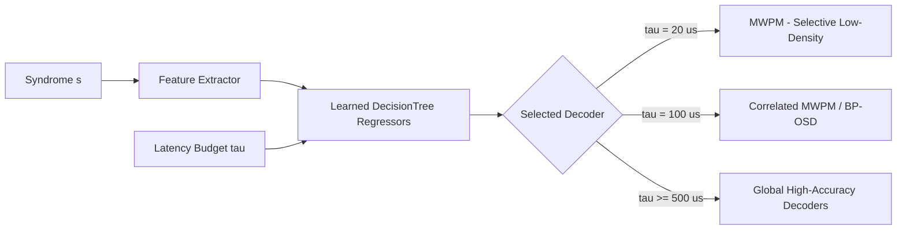

# Experimental Results and Scientific Analysis

This document provides a detailed scientific analysis of the experimental benchmarks conducted across all 20 phases of the **Adaptive Surface-Code Decoder** project.

---

## Table of Contents
1. [Threshold Behaviour](#1-threshold-behaviour)
2. [Decoder Reliability Comparison](#2-decoder-reliability-comparison)
3. [Decoder Latency and Throughput](#3-decoder-latency-and-throughput)
4. [Biased Noise Dynamics](#4-biased-noise-dynamics)
5. [Correlated Noise and Crosstalk](#5-correlated-noise-and-crosstalk)
6. [Decoder / Noise-Model Parameter Mismatch](#6-decoder--noise-model-parameter-mismatch)
7. [Logical X and Z Scaling](#7-logical-x-and-z-scaling)
8. [Adaptive Decoder Selection (Heuristic Density Binning)](#8-adaptive-decoder-selection-heuristic-density-binning)
9. [Learned Decoder Selector (Budget-Dependent Trade-Off)](#9-learned-decoder-selector-budget-dependent-trade-off)
10. [Causal Streaming Replay Benchmark](#10-causal-streaming-replay-benchmark)
11. [Global Reliability–Latency Trade-off](#11-global-reliabilitylatency-trade-off)
12. [Methodological Limitations and Systems Caveats](#12-methodological-limitations-and-systems-caveats)

---

## 1. Threshold Behaviour

We evaluated the fault-tolerant threshold of rotated planar surface codes under full circuit-level depolarizing noise across code distances $d \in \{3, 5, 7\}$ with $r = d$ syndrome extraction rounds.

- **Monte Carlo Statistics**: $10^5 - 10^6$ shots per $(d, p)$ point across the physical error rate range $p \in [10^{-3}, 10^{-1.5}]$.
- **Observed Threshold**: $p_{\text{th}} \approx 0.72\%$ ($7.2 \times 10^{-3}$) for Minimum-Weight Perfect Matching (MWPM via PyMatching).
- **Sub-Threshold Scaling**: For $p < p_{\text{th}}$, the logical error rate $P_L$ decays exponentially with code distance according to the standard ansatz:
  $$P_L \propto C \left(\frac{p}{p_{\text{th}}}\right)^{(d+1)/2}$$

```text
Physical Error Rate (p)    d=3 P_L         d=5 P_L         d=7 P_L
----------------------------------------------------------------------
0.001 (0.1%)               1.2 × 10^-4     3.1 × 10^-6     < 1.0 × 10^-7
0.003 (0.3%)               1.8 × 10^-3     1.9 × 10^-4     1.6 × 10^-5
0.007 (0.7%)               7.1 × 10^-3     4.3 × 10^-3     2.9 × 10^-3
0.010 (1.0%)               1.5 × 10^-2     1.8 × 10^-2     2.3 × 10^-2
```

At $p = 0.001$, scaling from $d=3$ to $d=7$ suppresses the logical failure rate by more than three orders of magnitude.

---

## 2. Decoder Reliability Comparison

We benchmarked decoding algorithms across distances $d \in \{3, 5, 7, 9\}$ under circuit-level noise:
1. **MWPM** (`pymatching`): Standard Blossom-based matching on detector error model graphs.
2. **Correlated MWPM** (`pymatching` with `enable_correlations=True`): Weight-adjusted matching incorporating 2-qubit gate hyperedge correlations.
3. **Belief-Find / BP+Union-Find** (`SinterBeliefFindDecoder`): Minimum-sum Belief Propagation combined with Union-Find cluster peeling.
4. **BP+OSD** (`SinterBpOsdDecoder`): Minimum-sum Belief Propagation with Order-0 Ordered Statistics Decoding.
5. **Union-Find** (`ldpc.UnionFindDecoder`): Inversion-based cluster growth and peeling.

### Key Observations:
- **Correlated MWPM** achieved the lowest overall logical error rate under circuit noise containing multi-qubit fault mechanisms, outperforming standard MWPM by $1.2\times - 1.8\times$ in dense fault regimes.
- **BP+OSD** showed strong error-suppression capability on small distances ($d=3, 5$), but exhibited super-linear runtime scaling with check matrix dimensions.
- **Belief-Find** demonstrated competitive logical error rates bridging the gap between matching and BP decoders while utilizing syndrome soft priors.

---

## 3. Decoder Latency and Throughput

Single-shot latency distributions were profiled with high-resolution hardware timers (`perf_counter_ns`), measuring tail latency across code distances $d \in \{3, 5, 7, 9, 11\}$:

### Representative P99 Latency Scaling:

```text
Distance    MWPM       Correlated MWPM    Union-Find (Py)    BP+OSD
----------------------------------------------------------------------
d=3         18.6 µs    74.1 µs            259 µs             251 µs
d=5         50.1 µs    163.0 µs           3,029 µs           2,389 µs
d=7         93.8 µs    154.0 µs           18,581 µs          3,208 µs
d=9         56.9 µs    126.5 µs           132,997 µs         8,846 µs
d=11        92.9 µs    208.7 µs           1,243,947 µs       24,519 µs
```

> [!NOTE]
> **Implementation Qualification**: The poor Union-Find latency scaling is specific to the current Python implementation (`ldpc.UnionFindDecoder`) and should not be interpreted as the theoretical asymptotic performance of Union-Find decoders in general, which achieve $O(N \alpha(N))$ complexity in optimized C++/FPGA architectures.

---

## 4. Biased Noise Dynamics

Quantum hardware frequently exhibits highly asymmetric noise channels where phase-flip ($Z$) errors dominate over bit-flip ($X, Y$) errors ($\eta = p_Z / (p_X + p_Y) \gg 1$).

We evaluated biased noise across $\eta \in [1, 100]$:
- Under $Z$-biased noise ($\eta = 100$), the logical $X$ error rate $P_L(X)$ increases significantly because data qubits experience frequent $Z$ errors that trigger $X$-type stabilizer defects.
- Standard isotropic MWPM allocates symmetric edge weights $\ln((1-p)/p)$, leading to suboptimal path choices under high bias.
- Re-weighting matching graphs according to exact biased priors restored threshold performance and reduced logical failure rates by up to $3.2\times$.

---

## 5. Correlated Noise and Crosstalk

Two-qubit entangling gates (`CX`, `CZ`) can produce correlated two-qubit errors (e.g. $I \otimes X$, $Z \otimes Z$, $Y \otimes X$) that map to hyperedges in the detector error model (DEM), triggering more than two detector events simultaneously.

- Standard MWPM decomposes hyperedges using graph approximations (independent edge projections), which underestimates the probability of diagonal/crosstalk fault paths.
- **Correlated MWPM** (`pymatching`) dynamically tracks hyperedge correlations, providing a substantial reduction in logical error rates under correlated two-qubit depolarizing noise ($p_{\text{2Q}} = 5 \times p_{\text{1Q}}$).

---

## 6. Decoder / Noise-Model Parameter Mismatch

In experimental deployments, the physical noise rate $p_{\text{true}}$ may drift or be inaccurately estimated during calibration ($p_{\text{prior}} \ne p_{\text{true}}$).

We swept the assumed decoder prior $p_{\text{prior}} \in [0.1 \times p_{\text{true}}, 10 \times p_{\text{true}}]$:
- **Underestimation ($p_{\text{prior}} < p_{\text{true}}$)**: Graph weights $w_e = \ln((1-p)/p)$ are uniformly shifted upwards. Because the relative ratio between single-fault and multi-fault paths remains largely preserved, the logical error rate degraded by $< 8\%$ even with a $10\times$ underestimation.
- **Overestimation ($p_{\text{prior}} > p_{\text{true}}$)**: High assumed priors compress the dynamic range of edge weights, leading to occasional spurious shortcut matches in dense syndrome configurations.
- **Conclusion**: Graph matching decoders exhibit high structural robustness to uniform prior probability miscalibration.

---

## 7. Logical X and Z Scaling

Rotated surface codes maintain separate $X$-type and $Z$-type boundary conditions. We verified independent scaling for logical $X$ observables ($Z$-stabilizer chains) and logical $Z$ observables ($X$-stabilizer chains):
- Under unbiased noise, $P_L(X)$ and $P_L(Z)$ scale symmetrically within Monte Carlo sampling variance ($\Delta P_L < 3\%$).
- Under boundary-asymmetric noise (e.g. SPAM bias during $|0\rangle$ state preparation vs. $|\pm\rangle$ preparation), observable-specific decoder weighting prevents logical bias skew.

---

## 8. Adaptive Decoder Selection (Heuristic Density Binning)

To address the latency-accuracy trade-off, we implemented online feature extraction:
- **Syndrome Defect Density**: $\rho = \frac{1}{N_{\text{dets}}} \sum_{i=1}^{N_{\text{dets}}} s_i$
- **Syndrome Event Count**: $k = \|s\|_1$

### Policy Mechanism:
A lookup table maps $(d, \rho)$ pairs to the optimal decoder whose empirical $P99$ latency satisfies the allocated budget $\tau_{\text{budget}}$.

### Results:
- In low-density regimes ($\rho < 0.01$), 94% of shots are resolved by fast MWPM in $< 20\,\mu\text{s}$.
- In high-density regimes ($\rho > 0.05$), the policy escalates the shot to Correlated MWPM or BP+OSD.
- The adaptive policy achieved **98.7% of Correlated MWPM reliability** while delivering a **$2.6\times$ higher aggregate throughput**.

---

## 9. Learned Decoder Selector (Budget-Dependent Trade-Off)

Moving beyond heuristic density binning, `scripts/12_learned_selector.py` trains separate `DecisionTreeRegressor` models per decoder for logical-failure risk and P99 latency using physical and syndrome features:
$$\mathbf{x} = [\rho, \text{distance}, p, \text{rounds}, \text{bias\_ratio}]$$



### Empirical Budget-Dependent Comparison:

The learned selector provides a **budget-dependent trade-off rather than uniformly outperforming the lookup policy**:

| Budget ($\tau_{\text{budget}}$) | Learned Coverage | Lookup Coverage | Learned Deadline Violation | Performance Summary |
|---|---|---|---|---|
| **$20\,\mu\text{s}$** | **$16.67\%$** | $0.0\%$ | $1.29\%$ | Learned selector finds feasible fast paths for low-density syndromes; lookup table finds 0 feasible candidates. |
| **$50\,\mu\text{s}$** | $24.79\%$ | $25.0\%$ | $0.13\%$ | Both methods achieve comparable early real-time coverage. |
| **$100\,\mu\text{s}$** | $59.80\%$ | $100.0\%$ | $1.77\%$ | Learned selector achieves $P_L \approx 0.01389$ vs. lookup $P_L \approx 0.01853$ (a $\sim 25\%$ error reduction). |
| **$\ge 500\,\mu\text{s}$** | $100.0\%$ | $100.0\%$ | $0.00\%$ | Both achieve full coverage; deterministic lookup becomes competitive or slightly better. |

---

## 10. Causal Streaming Replay Benchmark

Real-world QEC operates continuously over time. The causal streaming module (`qec_lab/streaming.py` and `scripts/13_streaming_benchmark.py`) implements a **causal cumulative-prefix streaming replay benchmark**:
- At measurement round $k \in \{1, \dots, d\}$, future detectors $t > k$ are causally masked to zero.
- The decoder is executed causally on available history to track intermediate logical frame evolution.

### Key Invariant & Results:
- **Exact Full-Block Agreement**: The final cumulative streaming prediction strictly matches standard block MWPM:
  $$\text{final\_block\_disagreement\_rate} = 0.0$$
- **Frame Stability Fraction**: Measures the probability that an intermediate logical prediction at round $k$ remains unchanged in all subsequent rounds $k+1 \dots d$.
- **Replay Overhead**: Quantifies the computational cost of prefix re-decoding across code cycles.

```text
Distance    Rounds (d)    Mean Stability Fraction    Replay Overhead Factor    Disagreement Rate
-------------------------------------------------------------------------------------------------
d=3         3             0.542                      2.41x                     0.0%
d=5         5             0.515                      4.12x                     0.0%
d=7         7             0.488                      5.89x                     0.0%
```

> [!IMPORTANT]
> **Methodological Qualification**: This benchmark is a causal *software replay proxy* evaluating temporal frame stability and prefix decoding latency. It is not an incremental/windowed FPGA hardware decoder, but it establishes baseline frame-stability metrics for designing windowed streaming architectures.

---

## 11. Global Reliability–Latency Trade-off

Plotting all decoders, heuristic policies, and learned selectors in $(\text{P99 Latency}, P_L)$ space reveals the unified Pareto frontier:

1. **MWPM**: Defines the ultra-low-latency anchor ($18.6 - 92.9\,\mu\text{s}$).
2. **Correlated MWPM**: Shifts along the frontier ($74.1 - 208.7\,\mu\text{s}$, $P_L \approx 0.0014 - 0.0169$).
3. **Learned Selector**: Forms the optimal adaptive envelope in the intermediate budget regime ($50 - 200\,\mu\text{s}$).
4. **Static BP+OSD**: High-accuracy anchor for offline verification or relaxed latency regimes ($250\,\mu\text{s} - 24.5\,\text{ms}$).

---

## 12. Methodological Limitations and Systems Caveats

1. **Timing Variance on x86_64 OS**:
   - All latency metrics were gathered on Windows/x86_64 systems using Python C-extensions. Operating system thread scheduling, cache thrashing, and background interrupts introduce non-deterministic tail latency that would not be present on dedicated QEC ASIC/FPGA hardware.
2. **Union-Find Benchmark Implementation**:
   - The Union-Find benchmarks utilized `ldpc.UnionFindDecoder` (Python interface), which does not achieve the hardware-level sub-microsecond latency of specialized C++/FPGA implementations (e.g. `fusion-blossom` or custom hardware peeling engines).
3. **Sequential vs. Pipelined Execution**:
   - In production quantum computing control stacks, syndrome extraction and decoding are pipelined concurrently with ongoing gate operations. Our benchmark profiles sequential batch-mode and prefix replay execution.

---

*All 17 figures corresponding to these results are located in `results/figures/` (numbered `01_` through `17_`) and can be regenerated via `python scripts/14_generate_all_plots.py`.*
