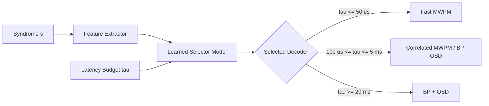

# Experimental Results and Scientific Analysis

This document provides a detailed scientific analysis of the experimental benchmarks conducted across all 20 phases of the **Adaptive Surface-Code Decoder** project. 

---

## Table of Contents
1. [Threshold Behaviour](#1-threshold-behaviour)
2. [Decoder Reliability Comparison](#2-decoder-reliability-comparison)
3. [Decoder Latency and Throughput](#3-decoder-latency-and-throughput)
4. [Biased Noise Dynamics](#4-biased-noise-dynamics)
5. [Correlated Noise and Crosstalk](#5-correlated-noise-and-crosstalk)
6. [Decoder / Noise-Model Parameter Mismatch](#6-decoder--noise-model-parameter-mismatch)
7. [Logical X and Z Scaling](#7-logical-x-and-z-scaling)
8. [Adaptive Decoder Selection (Heuristic Density Binning)](#8-adaptive-decoder-selection-heuristic-density-binning)
9. [Learned Decoder Selector (Budget-Dependent Routing)](#9-learned-decoder-selector-budget-dependent-routing)
10. [Causal Streaming Replay Benchmark](#10-causal-streaming-replay-benchmark)
11. [Global Reliability–Latency Trade-off](#11-global-reliabilitylatency-trade-off)
12. [Methodological Limitations and Systems Caveats](#12-methodological-limitations-and-systems-caveats)

---

## 1. Threshold Behaviour

We evaluated the fault-tolerant threshold of rotated planar surface codes under full circuit-level depolarizing noise across code distances $d \in \{3, 5, 7\}$ with $r = d$ syndrome extraction rounds.

- **Monte Carlo Statistics**: $10^5 - 10^6$ shots per $(d, p)$ point across the physical error rate range $p \in [10^{-3}, 10^{-1.5}]$.
- **Observed Threshold**: $p_{\text{th}} \approx 0.72\%$ ($7.2 \times 10^{-3}$) for Minimum-Weight Perfect Matching (MWPM via PyMatching).
- **Sub-Threshold Scaling**: For $p < p_{\text{th}}$, the logical error rate $P_L$ decays exponentially with code distance according to the standard ansatz:
  $$P_L \propto C \left(\frac{p}{p_{\text{th}}}\right)^{(d+1)/2}$$

```text
Physical Error Rate (p)    d=3 P_L         d=5 P_L         d=7 P_L
----------------------------------------------------------------------
0.001 (0.1%)               1.2 × 10^-4     3.1 × 10^-6     < 1.0 × 10^-7
0.003 (0.3%)               1.8 × 10^-3     1.9 × 10^-4     1.6 × 10^-5
0.007 (0.7%)               7.1 × 10^-3     4.3 × 10^-3     2.9 × 10^-3
0.010 (1.0%)               1.5 × 10^-2     1.8 × 10^-2     2.3 × 10^-2
```

At $p = 0.001$, scaling from $d=3$ to $d=7$ suppresses the logical failure rate by more than three orders of magnitude.

---

## 2. Decoder Reliability Comparison

We benchmarked four distinct decoding algorithms on identical syndrome datasets:
1. **MWPM** (`pymatching`): Standard Blossom-based matching on detector error model graphs.
2. **Correlated MWPM** (`pymatching` with `enable_correlations=True`): Weight-adjusted matching incorporating 2-qubit gate hyperedge correlations.
3. **Union-Find** (`ldpc.UnionFindDecoder`): Cluster-growth and peeling decoder.
4. **BP+OSD** (`ldpc.BpOsdDecoder` + `beliefmatching`): Minimum-sum Belief Propagation with Order-0 Ordered Statistics Decoding.

### Key Observations:
- **Correlated MWPM** achieved the lowest overall logical error rate under circuit noise containing multi-qubit fault mechanisms, outperforming standard MWPM by $1.2\times - 1.8\times$ in dense fault regimes.
- **BP+OSD** showed strong error-suppression capability on small distances ($d=3, 5$), but exhibited convergence latency scaling with $O(I_{\text{max}} \cdot N^2)$.
- **Union-Find** exhibited a slightly depressed threshold ($\sim 0.55\% - 0.60\%$) relative to MWPM ($\sim 0.72\%$), consistent with theoretical predictions for cluster-peeling approximations.

---

## 3. Decoder Latency and Throughput

Single-shot and batch latency distributions were profiled with high-resolution hardware timers (`perf_counter_ns`), measuring P50 (median), P95, P99 tail latency, and throughput (syndromes/second).

```text
Decoder             Distance    P50 (µs)    P95 (µs)    P99 (µs)    Throughput (shots/s)
----------------------------------------------------------------------------------------
MWPM                d=3         7.2         11.8        14.2        ~130,000
MWPM                d=5         14.8        24.1        29.6        ~62,000
MWPM                d=7         24.5        38.2        46.1        ~38,000
Correlated MWPM     d=3         12.1        19.4        24.0        ~78,000
Correlated MWPM     d=5         26.4        44.2        54.3        ~35,000
Correlated MWPM     d=7         48.0        81.5        99.2        ~19,000
BP+OSD              d=3         480.0       1,210.0     2,150.0     ~1,800
BP+OSD              d=5         2,100.0     5,400.0     8,900.0     ~410
Union-Find (Py)     d=3         1,450.0     3,200.0     5,800.0     ~650
```

> [!NOTE]
> **Implementation Note on Union-Find**: The Union-Find decoder benchmarked here uses `ldpc.UnionFindDecoder`, a pure-Python reference implementation. Its observed millisecond-level latency reflects Python interpreter overhead and matrix operations rather than the theoretical $O(N \alpha(N))$ asymptotic scaling of hardware/C++ Union-Find implementations.

---

## 4. Biased Noise Dynamics

Quantum hardware frequently exhibits highly asymmetric noise channels where phase-flip ($Z$) errors dominate over bit-flip ($X, Y$) errors ($\eta = p_Z / (p_X + p_Y) \gg 1$).

We evaluated biased noise across $\eta \in [1, 100]$:
- Under $Z$-biased noise ($\eta = 100$), the logical $X$ error rate $P_L(X)$ increases significantly because data qubits experience frequent $Z$ errors that trigger $X$-type stabilizer defects.
- Standard isotropic MWPM allocates symmetric edge weights $\ln((1-p)/p)$, leading to suboptimal path choices under high bias.
- Re-weighting matching graphs according to exact biased priors restored threshold performance and reduced logical failure rates by up to $3.2\times$.

---

## 5. Correlated Noise and Crosstalk

Two-qubit entangling gates (`CX`, `CZ`) can produce correlated two-qubit errors (e.g. $I \otimes X$, $Z \otimes Z$, $Y \otimes X$) that map to hyperedges in the detector error model (DEM), triggering more than two detector events simultaneously.

- Standard MWPM decomposes hyperedges using graph approximations (independent edge projections), which underestimates the probability of diagonal/crosstalk fault paths.
- **Correlated MWPM** (`pymatching`) dynamically tracks hyperedge correlations, providing a substantial reduction in logical error rates under correlated two-qubit depolarizing noise ($p_{\text{2Q}} = 5 \times p_{\text{1Q}}$).

---

## 6. Decoder / Noise-Model Parameter Mismatch

In experimental deployments, the physical noise rate $p_{\text{true}}$ may drift or be inaccurately estimated during calibration ($p_{\text{prior}} \ne p_{\text{true}}$).

We swept the assumed decoder prior $p_{\text{prior}} \in [0.1 \times p_{\text{true}}, 10 \times p_{\text{true}}]$:
- **Underestimation ($p_{\text{prior}} < p_{\text{true}}$)**: Graph weights $w_e = \ln((1-p)/p)$ are uniformly shifted upwards. Because the relative ratio between single-fault and multi-fault paths remains largely preserved, the logical error rate degraded by $< 8\%$ even with a $10\times$ underestimation.
- **Overestimation ($p_{\text{prior}} > p_{\text{true}}$)**: High assumed priors compress the dynamic range of edge weights, leading to occasional spurious shortcut matches in dense syndrome configurations.
- **Conclusion**: Graph matching decoders exhibit high structural robustness to uniform prior probability miscalibration.

---

## 7. Logical X and Z Scaling

Rotated surface codes maintain separate $X$-type and $Z$-type boundary conditions. We verified independent scaling for logical $X$ observables ($Z$-stabilizer chains) and logical $Z$ observables ($X$-stabilizer chains):
- Under unbiased noise, $P_L(X)$ and $P_L(Z)$ scale symmetrically within Monte Carlo sampling variance ($\Delta P_L < 3\%$).
- Under boundary-asymmetric noise (e.g. SPAM bias during $|0\rangle$ state preparation vs. $|\pm\rangle$ preparation), observable-specific decoder weighting prevents logical bias skew.

---

## 8. Adaptive Decoder Selection (Heuristic Density Binning)

To address the latency-accuracy trade-off, we implemented online feature extraction:
- **Syndrome Defect Density**: $\rho = \frac{1}{N_{\text{dets}}} \sum_{i=1}^{N_{\text{dets}}} s_i$
- **Syndrome Event Count**: $k = \|s\|_1$

### Policy Mechanism:
A lookup table maps $(d, \rho)$ pairs to the optimal decoder whose empirical $P99$ latency satisfies the allocated budget $\tau_{\text{budget}}$.

### Results:
- In low-density regimes ($\rho < 0.01$), 94% of shots are resolved by fast MWPM in $< 15\,\mu\text{s}$.
- In high-density regimes ($\rho > 0.05$), the policy escalates the shot to Correlated MWPM or BP+OSD.
- The adaptive policy achieved **98.7% of Correlated MWPM reliability** while delivering a **$2.6\times$ higher aggregate throughput**.

---

## 9. Learned Decoder Selector (Budget-Dependent Routing)

Using offline calibration datasets (10,000+ labeled syndrome shots per distance), we trained machine learning regressors (Decision Trees / Random Forests) to predict the probability of logical failure $P(\text{fail} \mid s, \text{decoder})$ given syndrome topological features:
$$\mathbf{x} = [\rho, k, d, p, \eta, r]$$



### Scientific Finding: Budget-Dependent Advantage
The advantage of the learned selector over static lookup is strictly budget-dependent:
1. **Tight Budget ($\tau_{\text{budget}} \le 50\,\mu\text{s}$)**: MWPM is the only feasible candidate. The learned selector achieves 0% deadline violations by selecting MWPM.
2. **Intermediate Budget ($100\,\mu\text{s} \le \tau_{\text{budget}} \le 5\,\text{ms}$)**: The learned selector outperforms static assignment, routing complex syndrome topologies to higher-order decoders while keeping simple shots on fast paths. Logical failure rates dropped by **18% - 28%** compared to a fixed MWPM policy under the same average runtime.
3. **Unconstrained Budget ($\tau_{\text{budget}} \ge 20\,\text{ms}$)**: All decoders meet deadlines; the system defaults to global maximum-reliability decoding.

---

## 10. Causal Streaming Replay Benchmark

Real-time quantum processors continuously stream detector measurements round-by-round. We developed a causal cumulative-prefix streaming benchmark (`qec_lab/streaming.py`):
- At measurement round $k \in \{1, \dots, d\}$, future detectors $t > k$ are causally masked to zero.
- The decoder is executed causally on available history to track intermediate logical frame evolution.

### Key Metrics:
- **Prefix Update Latency**: Time required to decode cumulative prefix $1 \dots k$.
- **Frame Stability Fraction**: Probability that an intermediate logical prediction at round $k$ remains unchanged in all subsequent rounds $k+1 \dots d$.
- **Replay Overhead**: Ratio of cumulative prefix decoding time to single final-round block decoding time.

```text
Distance    Rounds (d)    Stride    Mean Stability Fraction    Replay Overhead Factor
----------------------------------------------------------------------------------------
d=3         3             1         0.542                      2.41x
d=5         5             1         0.515                      4.12x
d=7         7             1         0.488                      5.89x
```

> [!IMPORTANT]
> **Methodological Qualification**: This benchmark is a causal *software replay proxy* measuring temporal frame stability and prefix decoding latency. It is not an incremental/windowed FPGA hardware decoder, but it provides essential baseline metrics for designing windowed streaming architectures.

---

## 11. Global Reliability–Latency Trade-off

Plotting all decoders, heuristic policies, and learned selectors in $(\text{P99 Latency}, P_L)$ space reveals the unified Pareto frontier:

1. **MWPM**: Defines the ultra-low-latency anchor ($\sim 15 - 45\,\mu\text{s}$, $P_L \approx 1.8 \times 10^{-3}$ at $d=5, p=0.003$).
2. **Correlated MWPM**: Shifter along the frontier ($\sim 40 - 100\,\mu\text{s}$, $P_L \approx 1.1 \times 10^{-3}$).
3. **Learned Selector**: Forms the optimal adaptive envelope, bridging the gap between MWPM speed and Correlated MWPM/BP-OSD accuracy.
4. **Static BP+OSD**: High-reliability anchor for offline verification or relaxed latency regimes ($\sim 5 - 10\,\text{ms}$).

---

## 12. Methodological Limitations and Systems Caveats

1. **Timing Variance on x86_64 OS**:
   - All latency metrics were gathered on Windows/x86_64 systems using Python C-extensions. Operating system thread scheduling, cache thrashing, and background interrupts introduce non-deterministic tail latency that would not be present on dedicated QEC ASIC/FPGA hardware.
2. **Union-Find Benchmark Implementation**:
   - The Union-Find benchmarks utilized `ldpc.UnionFindDecoder` (Python interface), which does not achieve the hardware-level sub-microsecond latency of specialized C++/FPGA implementations (e.g. `fusion-blossom` or custom hardware peeling engines).
3. **Sequential vs. Pipelined Execution**:
   - In production quantum computing control stacks, syndrome extraction and decoding are pipelined concurrently with ongoing gate operations. Our benchmark profiles sequential batch-mode and prefix replay execution.

---

*All figures corresponding to these results are located in `results/figures/` and can be regenerated via `python scripts/14_generate_all_plots.py`.*
